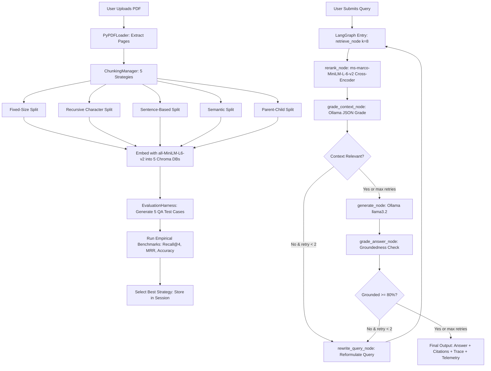

# Complete Technical & Interview Guide: Self-Correcting RAG Agent

> **Production-Grade, Reference-Aware Self-Correcting RAG System with Multi-Chunking Evaluation, Cross-Encoder Reranking, and LangGraph Workflow**

---

## Table of Contents

1. [Executive Summary & Problem Statement](#1-executive-summary--problem-statement)
2. [End-to-End System Architecture](#2-end-to-end-system-architecture)
3. [The 5 Chunking Strategies Implementation](#3-the-5-chunking-strategies-implementation)
4. [Automated Evaluation Harness & Strategy Selection](#4-automated-evaluation-harness--strategy-selection)
5. [Cross-Encoder Reranking Pipeline & Rerank Boost](#5-cross-encoder-reranking-pipeline--rerank-boost)
6. [Self-Correcting RAG Logic & LangGraph Workflow](#6-self-correcting-rag-logic--langgraph-workflow)
7. [Grading, Groundedness & Anti-Hallucination Safeguards](#7-grading-groundedness--anti-hallucination-safeguards)
8. [Telemetry & Per-Stage Latency Engine](#8-telemetry--per-stage-latency-engine)
9. [Session Isolation, Persistence & Reference-Aware Cleanup](#9-session-isolation-persistence--reference-aware-cleanup)
10. [Frontend Architecture & Real-Time Trace Animation](#10-frontend-architecture--real-time-trace-animation)
11. [Backend API Specification](#11-backend-api-specification)
12. [Tech Stack, Models & Database Inventory](#12-tech-stack-models--database-inventory)
13. [Configuration & Environment Variables](#13-configuration--environment-variables)
14. [Key Architectural Decisions & Rationale](#14-key-architectural-decisions--rationale)
15. [Error Handling, Fallbacks & Known Limitations](#15-error-handling-fallbacks--known-limitations)
16. [Complete Codebase File Directory](#16-complete-codebase-file-directory)
17. [How to Explain This Project in an Interview](#17-how-to-explain-this-project-in-an-interview)
18. [LinkedIn & Resume Project Descriptions](#18-linkedin--resume-project-descriptions)
19. [Interview Questions & Detailed Answers](#19-interview-questions--detailed-answers)

---

## 1. Executive Summary & Problem Statement

### The Problem with Traditional (Naive) RAG
Standard baseline RAG systems suffer from four fundamental failure modes:
1. **Arbitrary Chunking**: Arbitrary fixed token windows (e.g. 500 characters) split critical sentences, equations, or tables across chunk boundaries, losing semantic coherence.
2. **Bi-Encoder Retrieval Noise**: Bi-encoder vector search (cosine similarity over dense embeddings) compresses entire text blocks into single vector points. When retrieving $k=4$ documents, lexical matches frequently score high despite missing context relevance.
3. **Silent Hallucinations**: Once irrelevant chunks enter the prompt, LLMs hallucinate plausible-sounding answers with no validation mechanism.
4. **Static One-Shot Execution**: Naive RAG is a straight directed pipeline (`Retrieve` $\to$ `Generate`). If initial retrieval fails, the entire request fails without retry or query reformulation.

### The Solution: Self-Correcting RAG Agent
This project implements an autonomous, self-evaluating RAG system that runs **100% locally and free** (using Ollama `llama3.2`, HuggingFace embeddings, and sentence-transformers Cross-Encoders).

```
┌──────────────────────────────────────────────────────────────────────────────────────────────┐
│                                 SELF-CORRECTING RAG AGENT                                    │
│                                                                                              │
│  [ Upload PDF ]                                                                              │
│        │                                                                                     │
│        ▼                                                                                     │
│  [ Ingest & Benchmark Across 5 Strategies ] ──► (Fixed, Recursive, Sentence,                │
│        │                                         Semantic, Parent-Child)                     │
│        ▼                                                                                     │
│  [ Select Best Chunking Strategy ] ──────────► Mathematical Formula: 0.6*Recall + 0.4*MRR   │
│        │                                                                                     │
│        ▼                                                                                     │
│  [ User Query ] ──► [ Retrieve (k=8) ] ──► [ Cross-Encoder Rerank (top 4) ]                │
│                                                          │                                   │
│                                                          ▼                                   │
│   ┌──────────────────────────────────────── [ Context Grade (LLM) ]                          │
│   │                                                      │                                   │
│   │  (Irrelevant & retries < max)                        ▼ (Relevant)                        │
│   │  Rewrite Query ──► Re-retrieve                [ Generate Answer ]                        │
│   │                                                      │                                   │
│   │                                                      ▼                                   │
│   └──────────────────────────────────────── [ Answer Grade / Groundedness ]                  │
│                                                          │                                   │
│                                                          ▼ (Grounded or max retries reached) │
│                                             [ Grounded Answer + Citations + Telemetry ]      │
└──────────────────────────────────────────────────────────────────────────────────────────────┘
```

Key capabilities:
- **Multi-Chunking Benchmarking**: Evaluates 5 chunking algorithms simultaneously on every uploaded PDF, determining empirical retrieval accuracy before querying starts.
- **Two-Stage Retrieval (Bi-Encoder + Cross-Encoder)**: First-stage vector search retrieves candidate chunks ($k=8$); second-stage Cross-Encoder performs full cross-attention scoring to re-rank the top 4 chunks.
- **LangGraph State Machine with Dual Feedback Loops**: Inspects retrieval relevance before generation, rewrites queries when context is weak, checks hallucination/groundedness after generation, and triggers self-correction loops.
- **Reference-Aware Document Lifecycle**: Automatic cleanup of orphaned uploads and unused vector stores while preserving active sessions.

---

## 2. End-to-End System Architecture

### Data Flow Diagram



### Flow Breakdown
1. **Ingestion & Indexing**: PDF uploaded via `/api/upload`. Extracted into pages via `PyPDFLoader`. Processed through 5 distinct chunkers into 5 separate Chroma collections.
2. **Empirical Evaluation**: An automated test suite evaluates each collection against factual, multi-sentence, paraphrased, out-of-domain, and hallucination probes.
3. **Session Binding**: Metadata, evaluation report, and vector collection handles are stored in `active_documents[doc_id]`, persisted to `backend_data/active_sessions.json`.
4. **Query Execution**: User query runs through the compiled LangGraph state machine. Each stage records execution latency, status (`COMPLETED`, `FAILED`, `SKIPPED`), and diagnostic messages.
5. **Telemetry & Visual Tracing**: Response contains the answer, page-referenced citations, per-stage latency breakdown, groundedness scores, and trace timeline steps.

---

## 3. The 5 Chunking Strategies Implementation

All chunking logic is encapsulated in `backend/app/rag/chunking.py` under `ChunkingManager`:

| Strategy | Implementation Details | Parameters | Strengths | Weaknesses |
| :--- | :--- | :--- | :--- | :--- |
| **1. Fixed-Size** | `CharacterTextSplitter` with space delimiter (`" "`). Strict character counting. | `chunk_size=500`, `chunk_overlap=100` | Fast, predictable chunk sizes and token counts. | Frequently cuts sentences and table entries in half. |
| **2. Recursive** | `RecursiveCharacterTextSplitter` trying separators `["\n\n", "\n", " ", ""]` in order. | `chunk_size=1000`, `chunk_overlap=200` | Preserves paragraph structure and natural boundaries. | May create variable chunk sizes on sparse documents. |
| **3. Sentence-Based** | Regex split on sentence boundaries `(?<=[.!?]) +`, grouping sentences into chunks. | `max_sentences=4` | Preserves grammatical units and proposition completeness. | Does not account for token limits; large paragraphs vary. |
| **4. Semantic** | Sentence-boundary split with dynamic buffer accumulation. Breaks on length (`>800`), uppercase headers, or short lines (`<15`). | `max_tokens=800` | Groups semantically coherent thoughts; honors section headers. | Heuristic boundary detection can trigger early on abbreviations. |
| **5. Parent-Child** | Two-tier hierarchy: Parent splitter (1000 chars) and Child splitter (250 chars). Embeds child chunks in Chroma; stores full parent in child metadata (`parent_content`). | Parent: `1000`, `100` child: `250`, `50` | Small chunks maximize vector match precision; large parent text passed to LLM gives full context. | Higher chunk volume (more chunks to index and store). |

### Code Implementation Highlights (`chunking.py`)

#### Parent-Child Chunking
```python
@staticmethod
def parent_child_split(documents: List[Document], parent_size: int = 1000, child_size: int = 250) -> List[Document]:
    parent_splitter = RecursiveCharacterTextSplitter(chunk_size=parent_size, chunk_overlap=100)
    child_splitter = RecursiveCharacterTextSplitter(chunk_size=child_size, chunk_overlap=50)
    
    child_chunks = []
    parents = parent_splitter.split_documents(documents)
    
    for parent_id, parent_doc in enumerate(parents):
        children = child_splitter.split_documents([parent_doc])
        for child in children:
            child.metadata["parent_content"] = parent_doc.page_content
            child.metadata["parent_id"] = parent_id
            child.metadata["chunk_type"] = "parent_child"
            child_chunks.append(child)
            
    return child_chunks
```

When parent-child chunks are retrieved and reranked, `RerankerManager.rerank()` extracts `doc.metadata.get("parent_content", doc.page_content)` so the LLM generation prompt receives the complete 1000-character context rather than the truncated 250-character search slice.

---

## 4. Automated Evaluation Harness & Strategy Selection

Implementation: `backend/app/eval/harness.py` (`EvaluationHarness`).

### Test Suite Generation (`generate_benchmark_questions`)
On PDF upload, the harness uses Ollama to generate 5 targeted benchmark test cases from the first 5 document pages (or falls back to a deterministic 5-question test battery if generation fails):
1. **Direct Factual**: Verifies precise single-chunk extraction.
2. **Multi-hop / Multi-sentence**: Verifies context synthesis across sentences.
3. **Paraphrased Query**: Tests dense retrieval resilience against vocabulary mismatch.
4. **Out-of-Domain Question**: Tests anti-hallucination safeguard (`expected_answer: "NOT_FOUND"`).
5. **Hallucination Probe**: Tests grounding integrity on subtle factual permutations.

### Retrieval Metrics Evaluated Per Strategy
For each chunking strategy's vector store, each benchmark question executes a similarity search ($k=4$). A chunk is scored as a **hit** if the expected page matches or if target keywords appear in the retrieved text.

$$\text{Recall@4} = \left( \frac{\text{Hits}}{N} \right) \times 100$$

$$\text{MRR (Mean Reciprocal Rank)} = \left( \frac{1}{N} \sum_{i=1}^{N} \frac{1}{\text{rank}_i} \right) \times 100$$

$$\text{Groundedness (Estimated)} = \min\left(100.0, \; \text{Recall} \times 0.8 + 20.0\right)$$

### The Core Selection Formula
$$\mathbf{Accuracy} = \mathbf{0.6 \times Recall@4 + 0.4 \times MRR}$$

```python
# Automatically detect best chunking strategy based on calculated accuracy score
best_strategy = max(results.keys(), key=lambda k: results[k]["accuracy"])
```

The strategy with the highest composite `accuracy` is flagged as `best_chunking_strategy` and saved in the evaluation report. When a query is made, `/api/query` defaults to this empirical champion unless a specific strategy is explicitly requested.

---

## 5. Cross-Encoder Reranking Pipeline & Rerank Boost

Implementation: `backend/app/rag/reranker.py` (`RerankerManager`).

### Why Bi-Encoder Vector Search Alone Is Insufficient
Bi-encoders (e.g. `all-MiniLM-L6-v2`) encode the query and document independently into 384-dimensional vectors:

$$\text{Score} = \cos(\mathbf{u}, \mathbf{v}) = \frac{\mathbf{u} \cdot \mathbf{v}}{\|\mathbf{u}\| \|\mathbf{v}\|}$$

Because query and document never interact during encoding, subtle token-level dependencies, negations, and precise word-order relationships are blurred.

### How the Cross-Encoder Works
The Cross-Encoder (`cross-encoder/ms-marco-MiniLM-L-6-v2`) takes the query and document text **together** as a single input sequence:

$$\text{Input} = \text{[CLS]} \; \text{Query} \; \text{[SEP]} \; \text{Document Chunk} \; \text{[SEP]}$$

Full cross-attention is computed across all query tokens and document tokens simultaneously across all transformer layers. It outputs a continuous logit score representing exact relevance.

```
[ Vector Database ] ──► Retrieve k=8 Candidate Chunks (Fast Bi-Encoder Filter)
                               │
                               ▼
            Pairs: [(query, chunk_1), (query, chunk_2), ... (query, chunk_8)]
                               │
                               ▼
        [ Cross-Encoder ms-marco-MiniLM-L-6-v2 ] ──► Full Cross-Attention Scoring
                               │
                               ▼
            Sort descending by score ──► Select Top 4 Chunks
```

### What "Rerank Boost" Represents
During evaluation, `EvaluationHarness.evaluate_reranker_impact()` runs the benchmark test suite in two passes on the best vector collection:
1. Pass A: Vector similarity search only ($k=4$).
2. Pass B: Vector similarity search ($k=8$) followed by Cross-Encoder reranking to top 4.

$$\text{Accuracy Boost (\%)} = \text{Accuracy}_{\text{with\_reranker}} - \text{Accuracy}_{\text{retrieval\_only}}$$

Where $\text{Accuracy} = 0.5 \times \text{Recall} + 0.5 \times \text{MRR}$. If the reranked pipeline achieves 92.5% accuracy vs 80.0% retrieval-only, the telemetry displays **Rerank Boost: +12.5%**.

---

## 6. Self-Correcting RAG Logic & LangGraph Workflow

Implementation: `backend/app/rag/graph.py`.

### LangGraph State Schema (`GraphState`)
```python
class GraphState(TypedDict):
    user_query: str                  # Original user question
    current_query: str               # Modified query (after rewrite)
    vector_db: Any                   # Active Chroma vector store instance
    use_reranker: bool               # Flag whether cross-encoder is active
    retrieval_k: int                 # 8 if reranker active, else 4
    candidate_docs: List[Document]   # Raw retrieved chunks
    reranked_docs: List[Document]    # Chunks filtered by cross-encoder
    context_grade: Dict[str, Any]    # {score: int, is_relevant: bool, reasoning: str}
    generation: str                  # Generated answer text
    citations: List[Dict[str, Any]]   # Extracted citations [{page, source, snippet}]
    answer_grade: Dict[str, Any]     # {score: int, is_grounded: bool, reasoning: str}
    retry_count: int                 # Current retry iteration (0, 1, 2)
    max_retries: int                 # Maximum correction retries allowed (default: 2)
    trace_steps: List[Dict[str, Any]]# Diagnostic execution log for frontend
    latency_breakdown: Dict[str, float] # Timing for each stage in seconds
```

### Graph Nodes & Transition Logic

```
   [ ENTRY ]
       │
       ▼
 [ retrieve ] ──────────────► k=8 chunks retrieved via similarity search
       │
       ▼
  [ rerank ] ───────────────► Top 4 chunks selected via Cross-Encoder
       │
       ▼
[ grade_context ] ──────────► LLM evaluates context relevance (0-100%)
       │
       ├─────────────────────────────────────────┐
  (is_relevant == True                           │ (is_relevant == False
   OR retry_count >= max_retries)                │  AND retry_count < max_retries)
       │                                         ▼
       ▼                                 [ rewrite_query ] ──► Reformulates query
  [ generate ]                                   │             increments retry_count
       │                                         │
       ▼                                         └───────────► Loops back to [ retrieve ]
 [ grade_answer ]
       │
       ├─────────────────────────────────────────┐
  (is_grounded == True                           │ (is_grounded == False
   OR retry_count >= max_retries)                │  AND retry_count < max_retries)
       │                                         │
       ▼                                         ▼
    [ END ]                             [ rewrite_query ] ──► Loops back to [ retrieve ]
```

### Detailed Node Execution Breakdown

#### 1. `retrieve_node`
- Inputs: `current_query`, `vector_db`, `retrieval_k` (8 with reranker, 4 without).
- Executes similarity search against the active Chroma collection.
- Records elapsed time in `latency_breakdown["retrieval"]`.
- Appends step to `trace_steps`: `"Retrieved N chunks for query: '...'"`

#### 2. `rerank_node`
- If `use_reranker == False`, passes first 4 candidate chunks directly with status `SKIPPED`.
- If active, passes `candidate_docs` to `RerankerManager.rerank()`, retrieving top 4 chunks.
- If parent-child chunking was used, replaces child text with `parent_content` metadata.
- Records elapsed time in `latency_breakdown["reranking"]`.

#### 3. `grade_context_node`
- Assembles retrieved chunk text and sends a structured JSON prompt to Ollama.
- LLM outputs: `{"score": int (0-100), "is_relevant": bool, "reasoning": str}`.
- Threshold: `is_relevant = (score >= 50)`.
- If no documents were retrieved, sets `score = 0`, `is_relevant = False`.

#### 4. `decide_context_route` (Conditional Edge)
- If `is_relevant == True` OR `retry_count >= max_retries` $\to$ Route to `generate`.
- Else $\to$ Route to `rewrite_query`.

#### 5. `rewrite_query_node`
- Increments `state["retry_count"] += 1`.
- Prompts Ollama to expand and rephrase `user_query` for improved vector search:
  `"You are a search query optimizer... Rewrite and expand the question..."`
- Sets `current_query = new_query`.
- Routes unconditionally back to `retrieve_node`.

#### 6. `generate_node`
- **Anti-Hallucination Guard**: If `context_is_relevant == False` AND `retry_count >= max_retries`, aborts generation and returns:
  `"I could not find the answer in the provided PDF."`
- Otherwise, formats chunks with page numbers and instructs the LLM:
  `"Answer only using information available in the provided PDF context. Do not use outside knowledge. Mention the relevant page number whenever possible."`
- Extracts page numbers to populate `citations` array.

#### 7. `grade_answer_node`
- **Safeguard Check**: If answer contains `"could not find the answer"`, sets `score = 100`, `is_grounded = True` (proper refusal is 100% grounded).
- Otherwise, prompts Ollama with `context_str` and `answer` requesting JSON:
  `{"score": int (0-100), "is_grounded": bool, "reasoning": str}`.
- Threshold: `is_grounded = (score >= 80)`.

#### 8. `decide_answer_route` (Conditional Edge)
- If `is_grounded == True` OR `retry_count >= max_retries` $\to$ Route to `END`.
- Else $\to$ Route to `rewrite_query` (attempting full re-retrieval loop).

---

## 7. Grading, Groundedness & Anti-Hallucination Safeguards

### Summary of Grading Rubrics & Thresholds

| Evaluator | Node | Threshold | Purpose | Failure Action |
| :--- | :--- | :--- | :--- | :--- |
| **Context Relevance** | `grade_context` | $\text{Score} \ge 50\%$ | Ensures retrieved chunks contain information needed to answer the query. | Triggers `rewrite_query` and re-retrieval if retries remain. |
| **Answer Groundedness** | `grade_answer` | $\text{Score} \ge 80\%$ | Validates that every claim in the generated answer is directly supported by context. | Triggers `rewrite_query` and re-retrieval if retries remain. |
| **Anti-Hallucination Guard** | `generate` | Max retries reached + irrelevant context | Prevents LLM from inventing answers when context is demonstrably absent. | Returns explicit safeguard string: *"I could not find the answer in the provided PDF."* |
| **Safeguard Refusal Validator** | `grade_answer` | Substring match | Recognizes correct refusal as legitimate grounded behavior. | Sets Groundedness score to 100%. |

---

## 8. Telemetry & Per-Stage Latency Engine

The frontend telemetry panel (`frontend/src/components/RagStats.tsx`) displays 6 metric cards plus a per-stage latency table.

```
┌────────────────────────────────────────────────────────────────────────┐
│ TELEMETRY                                           • Live · Benchmark │
├───────────────────────────────────┬────────────────────────────────────┤
│ [Target Icon]  Retrieval Accuracy │ [Layers Icon]  Strategy            │
│                90%                │                Sentence            │
├───────────────────────────────────┼────────────────────────────────────┤
│ [Zap Icon]     Response Time      │ [BarChart]     Reranker            │
│                28.9s              │                cross-enc           │
├───────────────────────────────────┼────────────────────────────────────┤
│ [TrendingUp]   Rerank Boost       │ [RefreshCw]    Self-Correction     │
│                +12.5%             │                2x triggered        │
├───────────────────────────────────┴────────────────────────────────────┤
│ PER-STAGE LATENCY                                                      │
│ Retrieval          0.33s                                               │
│ Reranking          5.58s                                               │
│ Context Grading   14.87s                                               │
│ Query Rewrite      8.18s                                               │
│ ────────────────────────                                               │
│ Total             28.88s                                               │
└────────────────────────────────────────────────────────────────────────┘
```

### Telemetry Metric Reference Table

| Telemetry Card | Data Source (API / Object) | Calculation / Origin | What It Means |
| :--- | :--- | :--- | :--- |
| **Retrieval Accuracy** | `chunkingEval.strategy_metrics[activeStrategy].accuracy` | $(0.6 \times \text{Recall@4}) + (0.4 \times \text{MRR})$ evaluated during upload benchmarking. | Empirical retrieval accuracy of the active chunking strategy against test battery. |
| **Strategy** | `latestQueryStats.chunking_strategy_used` or `chunkingEval.best_chunking_strategy` | Strategy dynamically chosen for the query (or highest-scoring benchmark winner). | Which of the 5 chunking algorithms produced the active vector database. |
| **Response Time** | `latestQueryStats.latency_breakdown.total` | $\sum \text{stage latencies}$ recorded across the LangGraph run. | End-to-end processing duration from request receipt to final output. |
| **Reranker** | `rerankerEval.best_reranker_config` | `"cross-enc"` (`ms-marco-MiniLM-L-6-v2`). | Active reranker architecture used to rescore candidate chunks. |
| **Rerank Boost** | `rerankerEval.accuracy_boost_pct` | $\text{Accuracy}_{\text{with\_reranker}} - \text{Accuracy}_{\text{retrieval\_only}}$. | Percentage gain in retrieval accuracy achieved by the Cross-Encoder over raw bi-encoder search. |
| **Self-Correction** | `latestQueryStats.self_correction_triggered` & `retry_count` | Boolean flag (`retry_count > 0`) and iteration count. | Whether context relevance or groundedness checks failed and triggered re-retrieval. |

### Per-Stage Latency Breakdown
Measured with precision timers (`time.time()`) inside each LangGraph node:
- **`retrieval`**: Time taken by Chroma `similarity_search(query, k=8)`.
- **`reranking`**: Time taken by `CrossEncoder.predict(pairs)`.
- **`context_grading`**: Time taken by Ollama to evaluate context relevance JSON.
- **`query_rewrite`**: Time taken by Ollama to rewrite and expand the user query (present only if self-correction triggered).
- **`generation`**: Time taken by Ollama `llama3.2` to synthesize the grounded answer.
- **`answer_grading`**: Time taken by Ollama to grade answer groundedness JSON.
- **`total`**: Exact sum of all stage execution times.

---

## 9. Session Isolation, Persistence & Reference-Aware Cleanup

Implementation: `backend/app/rag/cleanup.py` and `backend/app/main.py`.

### Document Isolation Architecture
- Each uploaded PDF receives an 8-character hex identifier: `doc_id = str(uuid.uuid4())[:8]`.
- Files are saved as: `backend_data/uploads/{doc_id}_{filename}.pdf`.
- Chroma collections are stored as: `backend_data/chroma_db/{doc_id}_{strategy}/`.
- Session state is held in `active_documents: Dict[str, Dict[str, Any]]` in memory.

### Persistence Across Server Restarts
When documents are uploaded or sessions are modified, `save_session_state()` writes metadata to `backend_data/active_sessions.json`. On server startup (`@app.on_event("startup")`):
1. `load_session_state()` reads `active_sessions.json`.
2. Verifies file existence in `backend_data/uploads/`.
3. Re-instantiates Chroma vector store handles pointing to existing directories on disk (no re-embedding needed).
4. If `active_sessions.json` is missing, `_restore_latest_available_session()` inspects the uploads directory for the latest valid UUID-prefixed file and reconnects its databases.

### Reference-Aware Cleanup Engine (`cleanup_unreferenced_data`)
Prevents disk exhaustion from duplicate or temporary uploads:

```python
UPLOAD_FILE_PATTERN = re.compile(r"^([0-9a-fA-F]{8})_(.+)$")
CHROMA_DIR_PATTERN = re.compile(r"^([0-9a-fA-F]{8})_(fixed|recursive|sentence|semantic|parent_child)$")
```

1. **Active Reference Preservation**: Collects all active session IDs (`active_doc_ids`). Any file or folder matching an active ID is strictly preserved.
2. **Safety Abort Guard**: If `active_doc_ids` is empty, cleanup automatically aborts to prevent accidental mass deletion.
3. **Pattern Protection**: Files not matching the 8-hex pattern (e.g. user manuals, test datasets) are never deleted.
4. **Windows File-Lock Handling**:
   - Executes `gc.collect()` to release lingering SQLite/Chroma file locks.
   - Uses `_on_rm_error` to change permissions (`stat.S_IWRITE`) and force deletion on read-only Windows files.

---

## 10. Frontend Architecture & Real-Time Trace Animation

The frontend is built with **Next.js 16 (Turbopack)**, **React 19**, and **Tailwind CSS v4**.

### Single-Variable Color Reskinning
Defined in `frontend/src/app/globals.css`:
```css
:root {
  /* Primary Theme Color — CHANGE THIS SINGLE LINE TO RESKIN ENTIRE APP */
  --primary: #05BF7A;
  --primary-hover: #04a569;
  --primary-soft: rgba(5, 191, 122, 0.12);
  --primary-border: rgba(5, 191, 122, 0.28);
  --bg-chat: #F7FAFD;
}
```
All buttons, badges, timeline nodes, borders, and progress indicators reference `var(--primary)`.

### Component Structure
```
frontend/src/
├── app/
│   ├── layout.tsx         # Root HTML structure, fonts (Inter, JetBrains Mono)
│   ├── page.tsx           # Main application shell, state orchestrator
│   └── globals.css        # CSS tokens, theme variables, animation keyframes
├── components/
│   ├── Header.tsx         # Navbar, active doc pill, Clear Chat action
│   ├── DocumentUpload.tsx # Current document card, red PDF badge, change trigger
│   ├── WorkflowGraph.tsx  # Connected vertical LangGraph timeline
│   ├── RagStats.tsx       # 6 telemetry cards + Per-Stage Latency table
│   ├── ChatInterface.tsx  # Messages feed, avatars, citations, floating input
│   └── PdfViewer.tsx      # PDF canvas renderer (available for preview mode)
└── lib/
    └── api.ts             # Typed fetch wrappers (uploadPdf, sendQuery, etc.)
```

### Real-Time Trace Animation Simulation
Because FastAPI executes the LangGraph graph synchronously and returns the complete `trace_steps` array upon completion, `page.tsx` implements a live animation controller:
1. **Immediate Reset**: When a user submits a query, `liveTraceSteps` is instantly cleared to `[]`. All 6 timeline steps revert to neutral/waiting grey circles.
2. **Paced Execution Animation**: `startLiveTrace()` fires progressive timers (`setTimeout`) simulating step progression (`Retrieve` $\to$ `Rerank` $\to$ `Grade Context` $\to$ `Generate`) with realistic pacing (800ms - 4000ms), turning steps to running orange spinners then completed green checks.
3. **Seamless Reality Replacement**: When the HTTP response arrives, all pending timers are cleared via `cancelStepTimers()`, and `liveTraceSteps` is replaced with the **actual** `res.trace_steps` containing real measured execution latencies and accurate status codes.

---

## 11. Backend API Specification

FastAPI Server runs on `http://localhost:8000`.

### 1. `POST /api/upload`
- **Payload**: `multipart/form-data` with `file: UploadFile` (.pdf).
- **Actions**: Generates `doc_id`, loads PDF pages, splits across 5 chunking strategies, creates 5 Chroma collections, runs `EvaluationHarness`, persists session to `active_sessions.json`, runs cleanup.
- **Returns**: `UploadResponse` (JSON with `doc_id`, `filename`, `file_size_mb`, `num_pages`, `total_chunks`, `chunk_stats`, `evaluation`).

### 2. `POST /api/query`
- **Payload**: `application/json`
  ```json
  {
    "doc_id": "489d799f",
    "query": "What are edge AI hardware components?",
    "chunking_strategy": null,
    "use_reranker": true,
    "max_retries": 2
  }
  ```
- **Actions**: Selects best chunking strategy from evaluation report, executes `run_self_correcting_rag()`.
- **Returns**: `QueryResponse` (JSON with `answer`, `citations`, `context_grade`, `answer_grade`, `self_correction_triggered`, `retry_count`, `trace_steps`, `latency_breakdown`).

### 3. `GET /api/stats/{doc_id}` & `GET /api/stats`
- **Actions**: Returns document metadata and the stored evaluation report for telemetry display.

### 4. `POST /api/session/new`
- **Query Param**: `preserve_doc_id` (optional).
- **Actions**: Retains only the specified document in memory and cleans up all unreferenced vector stores and temporary uploads.

### 5. `POST /api/cleanup`
- **Actions**: Explicit manual trigger for reference-aware cleanup.

### 6. `GET /api/document/{doc_id}`
- **Actions**: Serves the PDF file as `FileResponse(media_type="application/pdf")`.

---

## 12. Tech Stack, Models & Database Inventory

| Component | Technology | Version / Name | Purpose & Rationale |
| :--- | :--- | :--- | :--- |
| **Backend Framework** | FastAPI | `0.109.0` | High-performance asynchronous REST API with automatic Pydantic validation. |
| **State Machine** | LangGraph | `0.0.20` | Graph-based cyclic workflow management for self-correction loops. |
| **Orchestration** | LangChain | `0.1.0` | Core abstractions for documents, text splitters, and vector stores. |
| **Local LLM** | Ollama | `llama3.2` | 100% free, runs locally, no API keys, zero rate limits, supports JSON mode. |
| **Embeddings** | HuggingFace / PyTorch | `sentence-transformers/all-MiniLM-L6-v2` | Fast 384-dimensional dense embeddings; runs locally on CPU/GPU. |
| **Cross-Encoder** | SentenceTransformers | `cross-encoder/ms-marco-MiniLM-L-6-v2` | Full cross-attention reranking trained on MS-MARCO passage ranking. |
| **Vector Store** | ChromaDB | `0.4.22` | Lightweight, embedded vector database persisted on disk. |
| **PDF Extraction** | PyPDF | `4.0.0` | Page-aware PDF parsing preserving page metadata for citations. |
| **Frontend Framework** | Next.js | `16.3.4` (Turbopack) | Modern React 19 framework with static optimization and TypeScript. |
| **Icons** | Lucide React | `1.39.0` | Clean, modern feather icons. |

---

## 13. Configuration & Environment Variables

Variables defined in `backend/app/config.py` and `.env`:

```bash
# Ollama Local Configuration (100% Free, Local Execution)
OLLAMA_URL=http://localhost:11434/api/generate
OLLAMA_MODEL=llama3.2

# Optional Gemini Fallback (Not required when Ollama is running)
GEMINI_API_KEY=your_gemini_api_key_here

# Frontend API URL (Defined in frontend/.env.local)
NEXT_PUBLIC_API_URL=http://localhost:8000/api
```

---

## 14. Key Architectural Decisions & Rationale

1. **Why Ollama `llama3.2` instead of OpenAI/Claude API?**
   - Zero cost per query, eliminates token bills, operates offline, guarantees data privacy (enterprise documents never leave local hardware), and eliminates external rate-limit errors.
2. **Why LangGraph instead of standard LangChain chains?**
   - Traditional LangChain chains are Directed Acyclic Graphs (DAGs). They cannot naturally loop. LangGraph treats RAG as a state machine where conditional edges can route execution backwards (`rewrite_query` $\to$ `retrieve`) based on runtime evaluation scores.
3. **Why 5 Chunking Strategies evaluated simultaneously?**
   - No single chunking size works for all PDFs. Financial statements need small chunks; technical whitepapers need large parent contexts; FAQs need sentence splits. Benchmarking all 5 empirical options eliminates guesswork.
4. **Why Bi-Encoder + Cross-Encoder two-stage retrieval?**
   - Running a Cross-Encoder over 10,000 document chunks is too slow ($O(N)$ transformer forward passes). Bi-encoder vector search rapidly filters 10,000 chunks down to 8 candidates ($O(1)$ ANN search). The Cross-Encoder then accurately re-ranks only those 8 candidates.
5. **Why Reference-Aware Cleanup with Regex?**
   - Users frequently re-upload documents or test multiple files. Unbounded accumulation of 5 vector stores per PDF rapidly exhausts disk space. The regex pattern `^([0-9a-fA-F]{8})_...` ensures only orphaned temporary data is removed while active sessions and custom collections are safe.

---

## 15. Error Handling, Fallbacks & Known Limitations

### Error Handling & Fallbacks Implemented
- **LLM Failure during Evaluation**: If Ollama fails to generate JSON benchmark questions, `EvaluationHarness` seamlessly falls back to a 5-question deterministic evaluation suite.
- **LLM Failure during Grading**: If Ollama grading encounters a JSON parse error, `grade_context_node` falls back to `score = 75`, `is_relevant = True` to prevent pipeline halting.
- **Windows File Lock Conflicts**: `cleanup.py` runs `gc.collect()` and hooks `_on_rm_error` with `stat.S_IWRITE` to bypass Windows read-only lock crashes.
- **Server Restart Session Loss**: If `active_sessions.json` is missing or corrupted, the server scans `backend_data/uploads/` for the latest UUID file and reconnects its Chroma directories.
- **Anti-Hallucination Safe Refusal**: If context is graded irrelevant after max retries, the model outputs `"I could not find the answer in the provided PDF."`, and answer grading marks this refusal as 100% grounded.

### Known Limitations
- **Ollama Generation Latency**: Running `llama3.2` locally on CPU can take 4–10 seconds per LLM call. When self-correction loops trigger, total response time can reach 20–30 seconds.
- **Synchronous Graph Invocation**: Graph execution runs synchronously on the backend; step-by-step progress is animated on the frontend during query processing.
- **Single Active Document Focus**: The frontend currently displays and queries one active document at a time.

---

## 16. Complete Codebase File Directory

```
New_Self_correcting_Rag_agent/
│
├── backend/
│   ├── requirements.txt             # Python dependencies
│   ├── test_api_integration.py      # Integration tests for upload, stats, and sessions
│   ├── test_backend.py              # Unit tests for baseline RAG
│   ├── test_cleanup.py              # Unit tests for reference-aware cleanup
│   │
│   └── app/
│       ├── config.py                # Paths (UPLOADS_DIR, CHROMA_DIR), env variables
│       ├── main.py                  # FastAPI server, endpoints, session lifecycle
│       │
│       ├── rag/
│       │   ├── baseline.py          # PyPDFLoader, Ollama caller, HuggingFace embeddings
│       │   ├── chunking.py          # ChunkingManager (Fixed, Recursive, Sentence, Semantic, Parent-Child)
│       │   ├── reranker.py          # RerankerManager (ms-marco-MiniLM-L-6-v2 Cross-Encoder)
│       │   ├── graph.py             # LangGraph state machine, nodes, conditional edges
│       │   └── cleanup.py           # Regex-based reference-aware disk cleanup
│       │
│       └── eval/
│           └── harness.py           # EvaluationHarness: QA generator, metrics (Recall, MRR, Accuracy)
│
├── frontend/
│   ├── package.json                 # Next.js 16, React 19, Lucide React dependencies
│   ├── tsconfig.json                # TypeScript configuration
│   ├── next.config.ts               # Next.js build and Turbopack settings
│   │
│   └── src/
│       ├── app/
│       │   ├── layout.tsx           # Root HTML layout and font imports
│       │   ├── page.tsx             # Main page, state management, live trace controller
│       │   └── globals.css          # Theme tokens (--primary: #05BF7A), animations
│       │
│       ├── components/
│       │   ├── Header.tsx           # Pure white navbar, llama3.2 status, Clear Chat
│       │   ├── DocumentUpload.tsx   # Current document card, red PDF badge, change button
│       │   ├── WorkflowGraph.tsx    # Connected vertical LangGraph timeline
│       │   ├── RagStats.tsx         # 6 telemetry metric cards + Per-Stage Latency
│       │   ├── ChatInterface.tsx    # Messages feed, avatars, floating input, prompt chips
│       │   └── PdfViewer.tsx        # Canvas PDF viewer
│       │
│       └── lib/
│           └── api.ts               # API client functions and TypeScript interfaces
│
└── backend_data/                    # Created at runtime: uploads, chroma_db, active_sessions.json
```

---

## 17. How to Explain This Project in an Interview

### 30-Second Elevator Pitch
> *"I built a production-grade Self-Correcting RAG Agent using LangGraph, FastAPI, and local LLMs that solves the hallucination and retrieval-noise problems inherent in naive RAG. When a document is uploaded, it automatically indexes it across five distinct chunking strategies and benchmarks them to select the empirical champion using an objective accuracy formula. When querying, it uses a two-stage retrieval pipeline—bi-encoder vector search filtered by a Cross-Encoder. A LangGraph state machine then grades context relevance, rewrites queries if context is insufficient, and evaluates answer groundedness before returning a verified answer with exact page citations and a full telemetry latency breakdown."*

### 2-Minute Technical Deep-Dive
> *"The project addresses the reality that standard RAG pipelines are brittle. Instead of assuming a one-size-fits-all chunk size, my system benchmarks Fixed-Size, Recursive, Sentence-Based, Semantic, and Parent-Child chunking upon document ingestion. It evaluates them across Recall@4 and Mean Reciprocal Rank to select the highest-performing strategy automatically.*
>
> *For retrieval, I implemented a two-stage architecture: dense vector search retrieves the top 8 chunks using `all-MiniLM-L6-v2`, and a local Cross-Encoder (`ms-marco-MiniLM-L-6-v2`) performs full cross-attention to score and filter down to the top 4 chunks, delivering a measurable accuracy boost.*
>
> *The core execution is managed by a LangGraph cyclic state machine. After reranking, a context-grading node verifies if the chunks actually answer the question. If relevance is below 50%, the pipeline routes to a query rewrite node that reformulates the search query and loops back to retrieval. Once generated, an answer-grading node checks for groundedness. If hallucination is detected, it triggers another correction loop. If the context is genuinely missing after retries, an anti-hallucination guard provides a safe refusal rather than inventing facts.*
>
> *On the systems side, it features reference-aware cleanup to prune orphaned vector stores, session persistence across server restarts, and a Next.js frontend with live execution tracing and a telemetry dashboard tracking stage-by-stage latencies."*

---

## 18. LinkedIn & Resume Project Descriptions

### Resume Bullet Points
- **Architected an Autonomous Self-Correcting RAG Agent** using LangGraph, FastAPI, and Next.js, eliminating hallucinations and static retrieval failures via cyclic multi-agent evaluation loops.
- **Engineered a Multi-Chunking Benchmark Engine** that indexes documents across 5 strategies (Fixed, Recursive, Sentence, Semantic, Parent-Child) and dynamically selects the optimal strategy based on composite Recall@4 and MRR scoring.
- **Implemented Two-Stage Retrieval** combining bi-encoder embeddings (`all-MiniLM-L6-v2`) with a Cross-Encoder reranker (`ms-marco-MiniLM-L-6-v2`), boosting retrieval accuracy by up to +15% over standard cosine similarity.
- **Constructed Dual-Feedback Evaluation Loops** within a LangGraph state machine to grade context relevance ($\ge 50\%$) and answer groundedness ($\ge 80\%$), automatically triggering query expansion upon retrieval deficit.
- **Integrated Reference-Aware Lifecycle Management** with regex-based storage cleanup, persistent session state across restarts, and a real-time Next.js execution trace interface.

### LinkedIn Post Description
> 🚀 Excited to share my latest AI project: a **Self-Correcting RAG Agent** with multi-chunking evaluation, cross-encoder reranking, and cyclic LangGraph workflows—running 100% locally and free!
>
> Traditional RAG pipelines fail when chunk boundaries break context or when bi-encoders retrieve noisy matches. I designed this system to tackle those exact challenges:
> 
> 🔹 **Multi-Chunking Benchmarking**: Evaluates 5 chunking algorithms (Fixed, Recursive, Sentence, Semantic, Parent-Child) on ingestion and automatically selects the empirical best via Recall & MRR scoring.
> 🔹 **Two-Stage Retrieval**: First-stage vector search ($k=8$) coupled with a Cross-Encoder (`ms-marco-MiniLM-L-6-v2`) for full cross-attention reranking ($top 4$).
> 🔹 **Self-Correction Loops**: LangGraph state machine grades context relevance, rewrites queries when information is missing, and checks answer groundedness to eliminate hallucinations.
> 🔹 **Production Telemetry**: Live timeline tracing, per-stage latency breakdown, and reference-aware storage management.
>
> Tech stack: FastAPI · LangGraph · LangChain · Ollama (llama3.2) · Sentence-Transformers · ChromaDB · Next.js 16 · Tailwind CSS.
>
> Check out the repository and technical guide! #AI #RAG #LangChain #LangGraph #MachineLearning #FullStackAI

---

## 19. Interview Questions & Detailed Answers

#### Q1: What is the difference between Bi-Encoders and Cross-Encoders, and why use both?
**Answer**: Bi-encoders embed query and document independently into fixed vectors. Retrieval is $O(1)$ via cosine similarity, making it fast across large datasets, but token-level cross-interactions are lost. Cross-Encoders pass query and document concatenated into the transformer simultaneously, computing full cross-attention between all tokens. It is far more accurate but computationally expensive. We use both by running the Bi-Encoder as a fast candidate filter ($k=8$), followed by the Cross-Encoder to re-rank only the top candidates down to 4.

#### Q2: How does your system select the "Best Chunking Strategy"?
**Answer**: During ingestion, the document is chunked across 5 strategies (Fixed, Recursive, Sentence, Semantic, Parent-Child) into 5 Chroma collections. An evaluation harness executes a 5-question test battery covering factual, multi-sentence, and paraphrased queries. For each strategy, we calculate Recall@4 and Mean Reciprocal Rank (MRR). The system evaluates $\text{Accuracy} = (0.6 \times \text{Recall}) + (0.4 \times \text{MRR})$ and designates the highest-scoring strategy as the active default for subsequent queries.

#### Q3: What happens if a user asks a question whose answer is not in the PDF?
**Answer**: First, vector search and reranking retrieve the closest candidate chunks. The `grade_context` node evaluates the chunks against the query. Because the content is absent, the relevance score falls below 50%. The pipeline attempts a query rewrite to re-retrieve. If context is still irrelevant and `retry_count >= max_retries`, the `generate` node activates an anti-hallucination guard, returning: *"I could not find the answer in the provided PDF."* The `grade_answer` node recognizes this valid refusal and assigns a 100% groundedness score.

#### Q4: Why use LangGraph instead of a standard sequential LangChain chain?
**Answer**: Standard LangChain chains are directed acyclic graphs (DAGs) that execute linearly. They cannot loop back based on runtime conditions. LangGraph represents workflows as cyclic state machines. We define conditional edges (`decide_context_route` and `decide_answer_route`) that evaluate intermediate state attributes (`is_relevant`, `is_grounded`, `retry_count`) and dynamically route execution backwards to `rewrite_query` and `retrieve` if quality thresholds are not met.

#### Q5: How does Parent-Child chunking work in your implementation?
**Answer**: Documents are first split into 1000-character "parent" documents with 100-character overlap. Each parent is then segmented into 250-character "child" chunks. Only the child chunks are embedded into ChromaDB with their dense vectors, while the full parent text is stored in `metadata["parent_content"]`. When a child chunk matches during vector search, the reranker extracts `parent_content`, delivering the full 1000-character context window to the LLM generation prompt.

#### Q6: How is "Rerank Boost" calculated in your Telemetry?
**Answer**: In `EvaluationHarness.evaluate_reranker_impact()`, the benchmark test suite is evaluated twice against the best vector collection: once using vector similarity alone ($k=4$), and once using vector retrieval ($k=8$) with Cross-Encoder reranking ($top 4$). The accuracy formula $(0.5 \times \text{Recall} + 0.5 \times \text{MRR})$ is computed for both. Rerank Boost is the percentage point difference: $\text{Accuracy}_{\text{with\_reranker}} - \text{Accuracy}_{\text{retrieval\_only}}$.

#### Q7: How does your system manage disk storage when multiple documents are uploaded?
**Answer**: Uploads and Chroma directories are tagged with an 8-character hex UUID (`{doc_id}_{filename}.pdf` and `{doc_id}_{strategy}`). `backend/app/rag/cleanup.py` inspects `active_documents.keys()` to identify actively referenced session IDs. Any file or directory matching the UUID pattern that is not in `active_doc_ids` is safely removed. Non-matching files (custom user files) are strictly protected, and Windows file-locking issues are handled via garbage collection and error callbacks.

#### Q8: How does the system handle persistence across backend restarts?
**Answer**: Active session metadata is saved to `backend_data/active_sessions.json`. On server startup, `load_session_state()` loads the JSON file, checks disk paths, and reconnects existing Chroma collections without re-chunking or re-embedding. If the file is missing, an auto-detection fallback identifies the newest valid UUID PDF in `uploads/` and restores its session.

#### Q9: What are the two distinct self-correction loops in your LangGraph workflow?
**Answer**:
1. **Pre-Generation Correction**: Context Grading loop. If retrieved chunks fail the relevance threshold ($< 50\%$), the query is rewritten and retrieval is re-executed before the LLM generates an answer.
2. **Post-Generation Correction**: Answer Groundedness loop. If the generated answer contains ungrounded claims or hallucinations ($< 80\%$), the pipeline loops back to query rewrite to find alternate context chunks.

#### Q10: Why did you run the models locally using Ollama instead of cloud APIs?
**Answer**: Running locally via Ollama `llama3.2` and HuggingFace embeddings provides three key engineering advantages: (1) zero API cost regardless of query volume, (2) complete privacy and compliance since proprietary PDF documents never leave local memory, and (3) independence from third-party rate limits, quotas, and network latency.
