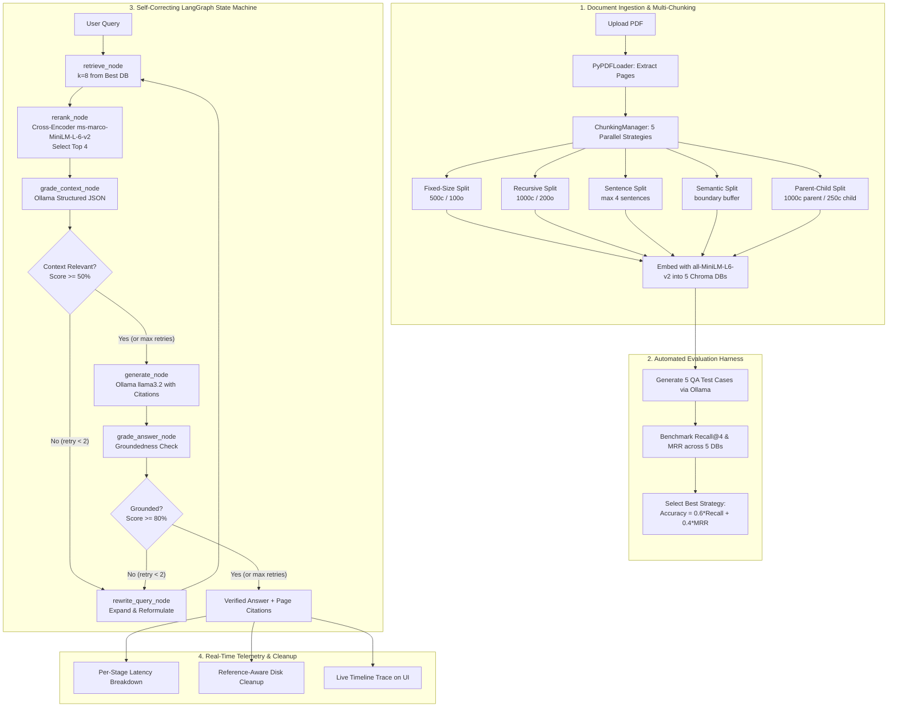

# ⚡ Self-Correcting RAG Agent

<div align="center">

[](https://www.python.org/)
[](https://fastapi.tiangolo.com/)
[](https://langchain-ai.github.io/langgraph/)
[-000000?style=for-the-badge&logo=ollama&logoColor=white)](https://ollama.com/)
[](https://nextjs.org/)
[](https://tailwindcss.com/)
[](https://opensource.org/licenses/MIT)

<p align="center">
  <strong>Production-Grade, 100% Local & Free Self-Correcting RAG System</strong><br>
  Multi-Chunking Benchmarking · Cross-Encoder Reranking · Dual-Loop Self-Correction · Reference-Aware Storage Cleanup · Real-Time Telemetry
</p>

</div>

---

## 📖 About The Project

Traditional (naive) RAG architectures execute as a brittle, one-way pipeline: `Chunk` $\to$ `Embed` $\to$ `Retrieve` $\to$ `Generate`. In production, this approach consistently breaks down due to four fundamental issues:
1. **Arbitrary Chunking**: Fixed-size token windows slice through sentences, equations, and tables, causing loss of critical context.
2. **Bi-Encoder Noise**: Dense cosine similarity retrieval often fetches superficially similar chunks that lack the specific information needed to answer the query.
3. **Silent Hallucinations**: When low-quality chunks reach the prompt, LLMs generate plausible-sounding falsehoods without any safety check.
4. **Static One-Shot Failure**: If initial retrieval fails, standard RAG cannot recover, resulting in wrong answers or empty responses.

### The Solution
The **Self-Correcting RAG Agent** is an autonomous, local, self-evaluating RAG system that eliminates these failure modes:
- **Evaluates 5 Chunking Strategies Simultaneously**: Automatically indexes every document across Fixed-Size, Recursive, Sentence-Based, Semantic, and Parent-Child chunkers.
- **Selects the Empirical Champion**: Runs an automated 5-probe test suite on ingestion and calculates composite accuracy ($0.6 \times \text{Recall@4} + 0.4 \times \text{MRR}$) to choose the best strategy.
- **Two-Stage Retrieval Pipeline**: Combines rapid bi-encoder dense vector search ($k=8$) with full cross-attention **Cross-Encoder reranking** (`ms-marco-MiniLM-L-6-v2`) to isolate the top 4 chunks.
- **Cyclic LangGraph State Machine**: Evaluates context relevance ($\ge 50\%$), rewrites queries dynamically when context is weak, and grades answer groundedness ($\ge 80\%$) before delivery.
- **Anti-Hallucination Safe Refusal**: If information is genuinely absent after retries, the model safely refuses to answer rather than hallucinating facts.
- **100% Local, Offline & Free**: Powered by local **Ollama `llama3.2`**, HuggingFace embeddings (`all-MiniLM-L6-v2`), and ChromaDB—no OpenAI API keys, zero token bills, and complete data privacy.

---

## 🔄 End-to-End System Architecture & Workflow



### Detailed Workflow Stages

1. **Document Ingestion**: Uploaded PDFs are assigned an 8-character hex UUID (`{doc_id}_{filename}.pdf`) to enforce session isolation.
2. **Multi-Chunk Indexing**: The document is split across 5 algorithms and stored in 5 distinct Chroma collections under `backend_data/chroma_db/{doc_id}_{strategy}`.
3. **Empirical Benchmarking**: An automated test suite probes each collection with direct factual, multi-sentence, paraphrased, out-of-domain, and hallucination questions. The strategy with the highest composite accuracy is flagged as default.
4. **First-Stage Vector Retrieval**: Fast dense vector search retrieves candidate chunks ($k=8$) from the champion collection.
5. **Second-Stage Cross-Encoder Reranking**: Full cross-attention pairs `(query, chunk_text)` score each candidate. The top 4 chunks are extracted with their rerank scores and page labels. If parent-child chunking was used, the full 1000-character parent text is passed to the context.
6. **Pre-Generation Context Grading**: An LLM evaluator grades context relevance (0–100%). If score $< 50\%$ and retries remain, the query is rewritten and retrieval is repeated.
7. **Grounded Generation**: The LLM synthesizes the answer strictly based on retrieved context, extracting page numbers for citation badges. If context is confirmed absent after retries, it activates an anti-hallucination safe refusal.
8. **Post-Generation Answer Grading**: An LLM evaluator verifies that every generated statement is grounded in the source text ($\ge 80\%$). If ungrounded, it loops back to query rewrite.
9. **Telemetry & Cleanup**: Real latencies for each stage are computed, the UI timeline updates, and unreferenced temporary vector stores are pruned.

---

## 🧩 The 5 Chunking Strategies

| Strategy | Implementation Details | Parameters | Best Suited For |
| :--- | :--- | :--- | :--- |
| **Fixed-Size** | `CharacterTextSplitter` with space delimiter. | `chunk_size=500`, `overlap=100` | Uniform text, baseline comparisons |
| **Recursive** | `RecursiveCharacterTextSplitter` splitting on paragraphs, then lines, then words. | `chunk_size=1000`, `overlap=200` | General documentation, mixed content |
| **Sentence-Based** | Regex sentence-boundary parsing `(?<=[.!?]) +`, grouping sentences. | `max_sentences=4` | Dense articles, narrative texts, academic papers |
| **Semantic** | Dynamic buffer accumulation split by sentence bounds, length thresholds, and headers. | `max_tokens=800` | Structured reports, section-heavy documents |
| **Parent-Child** | Two-tier hierarchy. Embeds 250c child chunks; attaches 1000c parent text to metadata. | Parent: `1000c`, Child: `250c` | Technical specifications, multi-topic pages |

---

## ⚡ LangGraph State Machine Architecture

The agent's execution graph is compiled using **LangGraph**:

```
[ ENTRY ] ──► [ retrieve ] ──► [ rerank ] ──► [ grade_context ]
                                                     │
                   ┌─────────────────────────────────┴─────────────────────────────────┐
     (is_relevant == True OR retry >= 2)                                 (is_relevant == False AND retry < 2)
                   │                                                                   │
                   ▼                                                                   ▼
             [ generate ]                                                      [ rewrite_query ]
                   │                                                                   │
                   ▼                                                                   └──────► (loops back to retrieve)
             [ grade_answer ]
                   │
                   ├─────────────────────────────────┐
     (is_grounded == True OR retry >= 2)     (is_grounded == False AND retry < 2)
                   │                                 │
                   ▼                                 ▼
                [ END ]                       [ rewrite_query ] ──► (loops back to retrieve)
```

### Graph Nodes
- **`retrieve`**: Performs similarity search against the active Chroma vector store ($k=8$ candidate chunks).
- **`rerank`**: Runs `ms-marco-MiniLM-L-6-v2` Cross-Encoder to rescore and select the top 4 chunks.
- **`grade_context`**: Structured JSON prompt evaluating context relevance percentage ($0-100\%$).
- **`rewrite_query`**: Reformulates and expands the search query using query optimization prompts.
- **`generate`**: Synthesizes the grounded answer with page citations and anti-hallucination safeguards.
- **`grade_answer`**: Evaluates answer faithfulness and groundedness score ($0-100\%$).

---

## 📊 Telemetry & Performance Dashboard

The frontend telemetry panel displays live, empirical metrics derived directly from backend evaluation and execution:

| Metric | Source | Description |
| :--- | :--- | :--- |
| **Retrieval Accuracy** | Evaluation Benchmark | Empirical accuracy: $0.6 \times \text{Recall@4} + 0.4 \times \text{MRR}$. |
| **Strategy** | Session / Query State | Active chunking strategy used for the query (e.g. `Sentence`, `Recursive`). |
| **Response Time** | `latency_breakdown.total` | Total end-to-end execution time in seconds. |
| **Reranker** | Cross-Encoder Module | `cross-enc` (`ms-marco-MiniLM-L-6-v2`). |
| **Rerank Boost** | Reranker Evaluation | Percentage gain in accuracy achieved by the Cross-Encoder over raw vector search. |
| **Self-Correction** | Query Response State | Shows whether self-correction was triggered and the exact retry count (`2x triggered`). |
| **Per-Stage Latency** | Timing Breakdown | Precise execution times for Retrieval, Reranking, Context Grading, Query Rewrite, and Generation. |

---

## 🛠️ Tech Stack

<div align="center">

| Layer | Technology | Version | Purpose |
| :--- | :--- | :--- | :--- |
| **Backend API** | FastAPI | `0.109.0` | High-performance asynchronous REST API |
| **State Machine** | LangGraph | `0.0.20` | Cyclic graph state management for self-correction loops |
| **Framework** | LangChain | `0.1.0` | Text splitters, document loaders, vector store abstractions |
| **Local LLM** | Ollama (`llama3.2`) | Latest | Local generation, structured JSON grading, query rewriting |
| **Embeddings** | HuggingFace / PyTorch | `all-MiniLM-L6-v2` | 384-dimensional dense semantic vectors |
| **Reranker** | Sentence-Transformers | `ms-marco-MiniLM-L-6-v2` | Cross-attention transformer passage reranker |
| **Vector Store** | ChromaDB | `0.4.22` | Disk-persisted vector collections |
| **PDF Extraction** | PyPDF | `4.0.0` | Page-aware PDF text extraction |
| **Frontend UI** | Next.js (Turbopack) | `16.3.4` | Modern React 19 web application |
| **Styling** | Tailwind CSS | `v4` | Modern responsive layout with theme tokens |
| **Icons** | Lucide React | `1.39.0` | Feather icons |

</div>

---

## 📁 Project Folder Structure

```
New_Self_correcting_Rag_agent/
│
├── backend/
│   ├── requirements.txt             # Python dependencies
│   ├── test_api_integration.py      # Integration tests for upload, stats, and sessions
│   ├── test_backend.py              # Unit tests for baseline RAG
│   ├── test_cleanup.py              # Unit tests for reference-aware cleanup
│   │
│   └── app/
│       ├── config.py                # File paths (UPLOADS, CHROMA), environment loading
│       ├── main.py                  # FastAPI server, endpoints, session persistence
│       │
│       ├── rag/
│       │   ├── baseline.py          # PyPDFLoader, Ollama caller, HuggingFace embeddings
│       │   ├── chunking.py          # ChunkingManager (Fixed, Recursive, Sentence, Semantic, Parent-Child)
│       │   ├── reranker.py          # RerankerManager (ms-marco-MiniLM-L-6-v2 Cross-Encoder)
│       │   ├── graph.py             # LangGraph state machine, nodes, conditional edges
│       │   └── cleanup.py           # Reference-aware regex disk cleanup & Windows file safety
│       │
│       └── eval/
│           └── harness.py           # EvaluationHarness: QA generator, Recall@4, MRR, accuracy selection
│
├── frontend/
│   ├── package.json                 # Next.js 16, React 19, Lucide React dependencies
│   ├── tsconfig.json                # TypeScript configuration
│   ├── next.config.ts               # Next.js Turbopack build configuration
│   │
│   └── src/
│       ├── app/
│       │   ├── layout.tsx           # Root HTML layout and typography imports
│       │   ├── page.tsx             # Main page, session state, live trace animation controller
│       │   └── globals.css          # Theme tokens (--primary: #05BF7A), message styles, animations
│       │
│       ├── components/
│       │   ├── Header.tsx           # Pure white navbar, Ollama badge, Clear Chat trigger
│       │   ├── DocumentUpload.tsx   # Current document card, red PDF badge, change button
│       │   ├── WorkflowGraph.tsx    # Connected vertical LangGraph execution timeline
│       │   ├── RagStats.tsx         # 6 telemetry metric cards + Per-Stage Latency table
│       │   ├── ChatInterface.tsx    # Messages feed, bot avatar, copy action, floating input, prompt chips
│       │   └── PdfViewer.tsx        # PDF document canvas renderer
│       │
│       └── lib/
│           └── api.ts               # Typed fetch wrappers (uploadPdf, sendQuery, fetchStats, etc.)
│
├── backend_data/                    # Runtime storage (uploads, chroma_db, active_sessions.json)
├── PROJECT_GUIDE.md                 # Complete 700+ line technical & interview reference guide
└── README.md                        # This file
```

---

## 🚀 How to Run Backend & Frontend

### 1. Prerequisites
- **Python 3.10+**
- **Node.js 18+** & **npm**
- **Ollama**: Installed and running locally ([Download Ollama](https://ollama.com/))

Make sure the local model is pulled and available:
```bash
ollama pull llama3.2
```

---

### 2. Backend Setup & Startup

1. **Activate your Python environment**:
   - On Windows:
     ```powershell
     .\.venv\Scripts\Activate.ps1
     ```
   - On macOS/Linux:
     ```bash
     source .venv/bin/activate
     ```

2. **Install dependencies**:
   ```bash
   pip install -r backend/requirements.txt
   ```

3. **Verify or create configuration** (optional):
   A `.env` file at the root or inside `backend/` can configure custom endpoints:
   ```env
   OLLAMA_URL=http://localhost:11434/api/generate
   OLLAMA_MODEL=llama3.2
   ```

4. **Start the FastAPI backend server**:
   ```bash
   uvicorn backend.app.main:app --reload --port 8000
   ```
   The backend API will be running at `http://localhost:8000`. You can explore interactive Swagger docs at `http://localhost:8000/docs`.

---

### 3. Frontend Setup & Startup

1. **Navigate to the frontend directory**:
   ```bash
   cd frontend
   ```

2. **Install frontend dependencies**:
   ```bash
   npm install
   ```

3. **Start the Next.js development server**:
   ```bash
   npm run dev
   ```
   The frontend will be available at `http://localhost:3000`.

4. **Open your browser**:
   Navigate to `http://localhost:3000`, upload any PDF, and watch the multi-chunking evaluation and self-correcting RAG in action!

---

## 🧪 Running Tests

To verify backend components, run the test suite:

```bash
# Test reference-aware cleanup logic
python backend/test_cleanup.py

# Test API integration (upload, stats, session preservation)
python backend/test_api_integration.py

# Test baseline RAG functionality
python backend/test_backend.py
```

To verify the frontend build:
```bash
cd frontend
npm run build
```

---

## 🎨 Theme Customization

The entire frontend theme is controlled by a single CSS variable in `frontend/src/app/globals.css`:

```css
:root {
  /* Primary Theme Color — CHANGE THIS ONE LINE TO RESKIN THE APP */
  --primary: #05BF7A;
  --bg-chat: #F7FAFD;
}
```
Changing `--primary` will automatically update all buttons, checkmarks, progress bars, timeline lines, and badges across the application.

---

## 📄 License

This project is licensed under the **MIT License** — see the [LICENSE](LICENSE) file for details.

```text
MIT License

Copyright (c) 2026

Permission is hereby granted, free of charge, to any person obtaining a copy
of this software and associated documentation files (the "Software"), to deal
in the Software without restriction, including without limitation the rights
to use, copy, modify, merge, publish, distribute, sublicense, and/or sell
copies of the Software, and to permit persons to whom the Software is
furnished to do so, subject to the following conditions:

The above copyright notice and this permission notice shall be included in all
copies or substantial portions of the Software.

THE SOFTWARE IS PROVIDED "AS IS", WITHOUT WARRANTY OF ANY KIND, EXPRESS OR
IMPLIED, INCLUDING BUT NOT LIMITED TO THE WARRANTIES OF MERCHANTABILITY,
FITNESS FOR A PARTICULAR PURPOSE AND NONINFRINGEMENT. IN NO EVENT SHALL THE
AUTHORS OR COPYRIGHT HOLDERS BE LIABLE FOR ANY CLAIM, DAMAGES OR OTHER
LIABILITY, WHETHER IN AN ACTION OF CONTRACT, TORT OR OTHERWISE, ARISING FROM,
OUT OF OR IN CONNECTION WITH THE SOFTWARE OR THE USE OR OTHER DEALINGS IN THE
SOFTWARE.
```

---

## 🙏 Acknowledgements & Thank You

A huge thank you to the open-source community and the creators of the foundational technologies that made this project possible:

- **[LangChain & LangGraph Teams](https://github.com/langchain-ai)** for providing the expressive state machine primitives for cyclic agent workflows.
- **[Ollama Team](https://ollama.com/)** for making fast, local LLM execution seamless, accessible, and completely private.
- **[Sentence-Transformers](https://sbert.net/)** and **[HuggingFace](https://huggingface.co/)** for the open-source embeddings and Cross-Encoder reranking models.
- **[ChromaDB Team](https://www.trychroma.com/)** for their lightweight, open-source embedded vector database.
- **[Vercel & Next.js Team](https://nextjs.org/)** for the Next.js framework and Turbopack bundler.

---

<div align="center">
  <sub>Built with ❤️ for reliable, hallucination-free Document AI.</sub>
</div>
